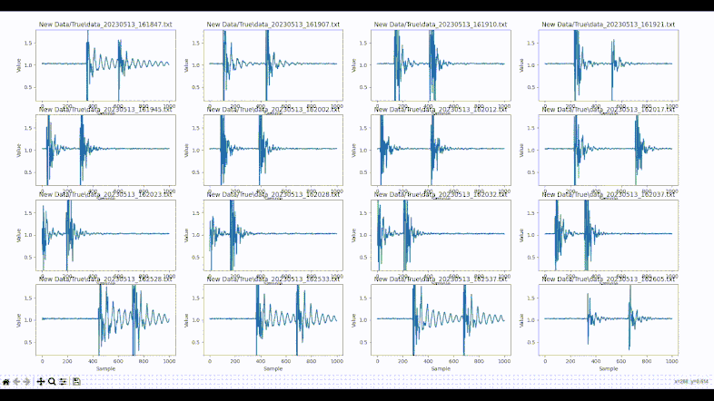
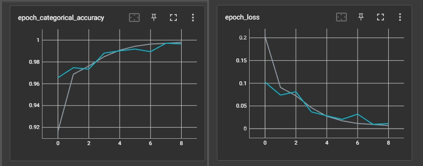
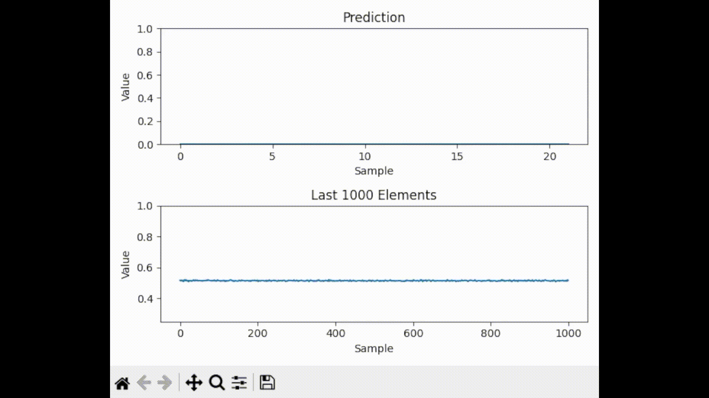

# ESP32-TFLite-Knock-Detector

## Introduction

The ESP32 Knock Detector project aims to create a self-contained system using an ESP32 WROVER microcontroller that can detect knocks and trigger an action, such as turning on a desk lamp. The project utilizes an accelerometer (MPU6050) to sense vibrations and classify them as knock or non-knock events. This write-up provides an overview of the project's development process and key components.

## Project Timeline

-   ### Data Collection

    Data collection is a crucial step in training the knock detection model. The project utilizes an Arduino Mega and an MPU6050 accelerometer to capture accelerometer data. The Arduino Mega reads and stores the data from the MPU6050 in the Z-axis into a buffer. This buffered data is then transferred to a Python program for visualization and further processing.

    The Python program allows selecting and storing data files in the 'True' and 'False' directories, representing knock and non-knock events, respectively. Each data file contains 1000 samples collected from the accelerometer.

-   ### Data Visualization and Verification

    To verify the collected data and identify any mislabeled samples, another Python script is used. This script displays nine data files simultaneously, allowing for quick visualization and inspection. This visual inspection helps ensure the accuracy of the labeling process and reduces the chance of false positives.

    

-   ### AI Model Training

    The collected and labeled accelerometer data is used to train an AI model for knock classification. The training data consists of the 1000-sample data files stored in the 'True' and 'False' directories. A Sequential model is created using Keras and TensorFlow, comprising multiple Conv1D and Dense layers. The model architecture includes dilated convolutions to capture temporal dependencies effectively.

    The trained AI model achieves an accuracy of 99.71% and a validation accuracy of 99.29%, demonstrating its ability to accurately classify knock events.

    -   Model Architecture:

        Input (1000, 1, 1)   |--- Conv2D (8, (100, 1), activation='relu') |--- AveragePooling2D ((2, 1), strides=(2, 1))   |--- Conv2D (16, (15, 1), activation='relu') |--- AveragePooling2D ((2, 1))   |--- Conv2D (16, (5, 1), activation='relu') |--- AveragePooling2D ((2, 1))   |--- Conv2D (16, (3, 1), activation='relu') |--- AveragePooling2D ((2, 1))   |--- Flatten |--- Dense (32, activation='relu') |--- Dense (2, activation='softmax')

    -   Training graphs:

        

-   ### Model Pruning

    To optimize the trained model and reduce its size, model pruning is applied. The TensorFlow Model Optimization library is used to prune the model by applying sparsity to the model's parameters. Pruning the model reduces its size while maintaining a high level of accuracy. The pruned model achieves a significant reduction in size, reducing the model file from 431 KB to 157 KB.

-   ### Model Quantization

    To prepare the model for deployment on the ESP32 WROVER microcontroller, quantization is applied. Quantization converts the model to use 16-bit integer weights and biases, reducing the memory requirements and improving inference speed on resource-constrained devices. The quantized model further reduces the model size to 39 KB while maintaining reasonable accuracy.

    

-   ### ESP32 Integration

    In the ESP32 integration step of the project, I have successfully integrated the pruned and quantized model with the ESP32 WROVER microcontroller. To accomplish this, I have used the TFLite Micro ESP examples repository (https://github.com/espressif/tflite-micro-esp-examples) to load the TensorFlow Lite (TFLite) library into the ESP32 IDF.

    To run the inference using the 16-bit quantized model, I have made some modifications to the code. Firstly, I have divided the tasks between two cores of the ESP32. The data collection script runs on core 0, which fills up a circular buffer with accelerometer data. Meanwhile, core 1 continuously runs the inference using the loaded model.

    The circular buffer has a size of 1700 samples, and the data collection script reads data from the accelerometer at a rate of 588 samples per second. Once the buffer is filled, the inference process starts. The input data for the model is prepared by copying the last 1000 samples from the buffer to the input_data array.

    After invoking the model using the TFLite interpreter, the output tensor data is accessed and printed. Additionally, a threshold of 0.85 is used to determine if a knock event is detected based on the output value. If the output value exceeds the threshold, the onboard LED (GPIO_NUM_0) is set to 1, indicating a knock event.

    I have also added a function to print the current heap memory usage to monitor memory consumption during runtime.

    With these modifications, the inference time has been significantly reduced. Before quantization, a single inference took 0.7 seconds, but with 16-bit quantization, it now takes only 0.4 seconds per inference.

## Conclusion

https://github.com/Foxunderground0/ESP32-TFLite-Knock-Detector/assets/54197021/2f5ac7a5-a42d-4f32-a259-dbd005960a2c

The ESP32 Knock Detector project aims to create a reliable and efficient system for detecting knocks and triggering actions using an ESP32 WROVER microcontroller. By combining data collection, AI model training, model optimization, and microcontroller integration, the project enables the detection of knock events in real-time. The ultimate goal is to create a self-contained system that can be easily deployed and used for various applications, such as home automation or security systems.

Please note that the project specifically focuses on using the Z-axis data from the accelerometer and requires two consecutive knocks to activate the system.
